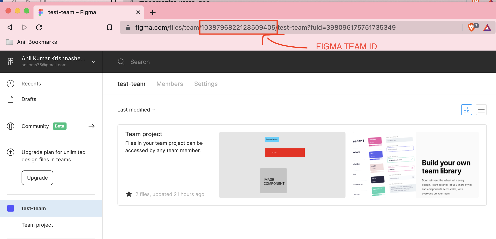
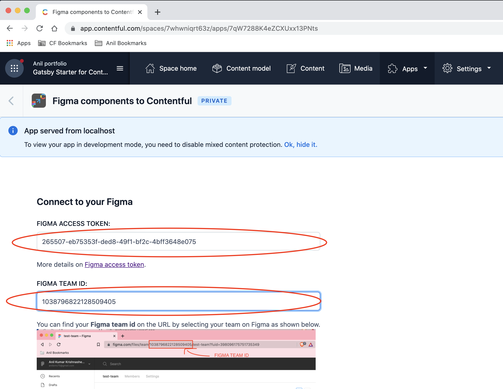
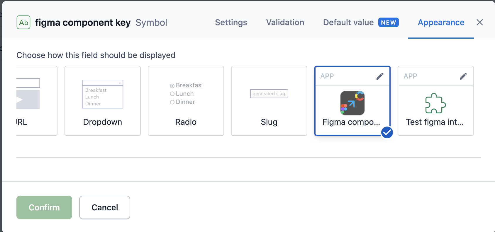

## Step 1: Get your Figma access token and team ID.
### To use this app you need 
1. Your [Figma access token](https://www.figma.com/developers/api#access-tokens) and  
2. Your [Figma team id](https://spectrum.chat/figma/general/how-to-get-team-id-and-project-id-for-api~191126f9-ec4f-4c4f-9964-766ae2b4916f).
You can find your Figma team id on the URL by selecting your team on Figma as shown below.

3. Your [Figma components library](https://help.figma.com/hc/en-us/articles/360041051154-Guide-to-libraries-in-Figma)

## Step 2: Update **Figma access token** and **Figma team id** on the configuration screen as shown below. 

## Step 3: Set content type field to Figma component key appearance  on your Content Type on Contentful.

## See it in action

## Feedback
If you have any feedback to share reach out to [Anil Kumar](https://twitter.com/anilbms75) or open a GitHub issue. 

This project was bootstrapped with [Create Contentful App](https://github.com/contentful/create-contentful-app).